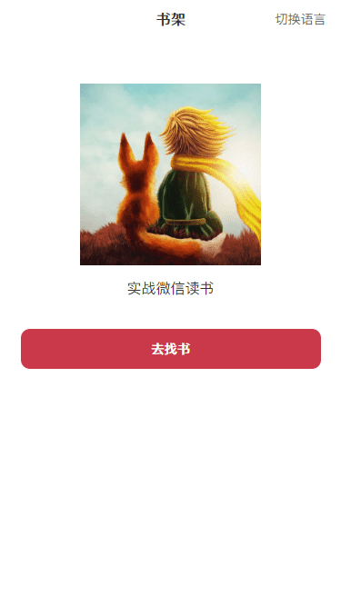
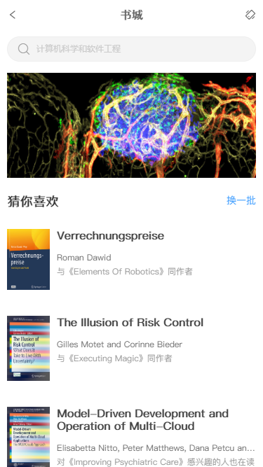
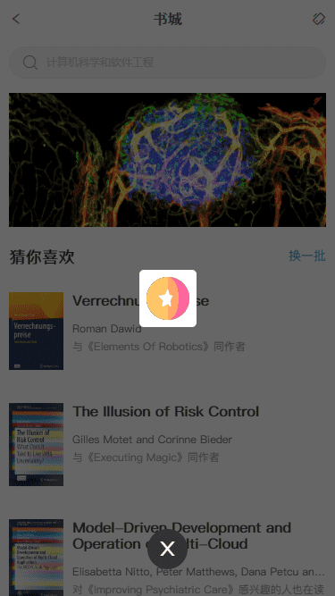
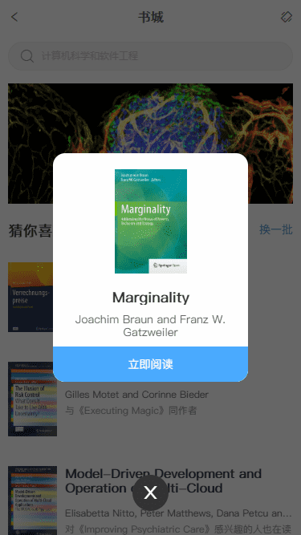
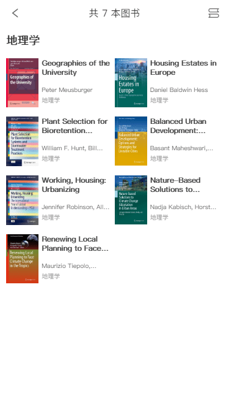
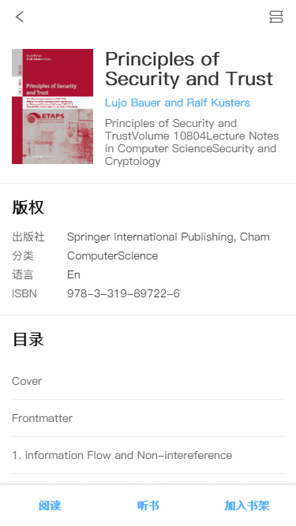
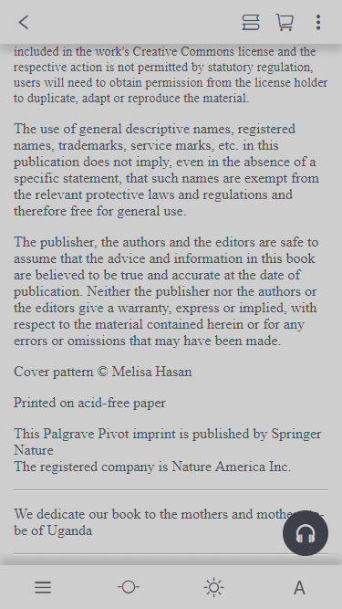
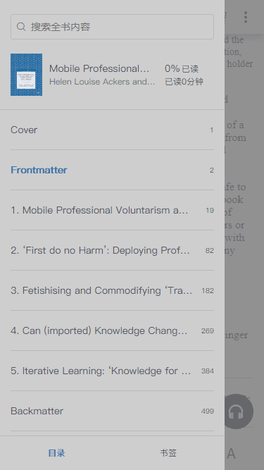
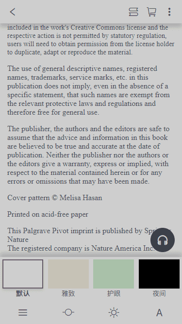

# vue-ebook

## 项目描述

本项目仿照《微信读书》进行开发，使用Vue+epubjs开发客户端，Express+MySQL开发服务端。主要包括：书城页、书架页、听书页、书籍详情页以及阅读器页等。

## 如何运行

+ 克隆代码：`https://github.com/VueToLRH/vue-ebook.git`
+ 安装依赖：`npm install`
+ 客户端运行：`npm run serve`
+ 服务端运行：`node .\server\bin\www`
+ 打包：`npm run build`
+ ESlint检查：`npm run lint`

## Nginx

+ 配置注释

  ``` nginx
  server {
    listen 9001; # 站点监听端口
    server_name resource; # 站点访问域名
    root E:/WorkSpace/MyWorkSpace/Vue/vue-ebook/resource; # 指定目录所在路径
    autoindex on; # 开启目录浏览
    # location用来匹配同一域名下多个URI的访问规则
    # 比如动态资源如何跳转，静态资源如何跳转等
    # location后面跟着的/代表匹配规则
    location / {
      # 重新定义或者添加发往后端服务器的请求头
      add_header Access-Control-Allow-Origin *;
    }
    add_header Cache-Control "no-cache, must-revalidate";
  }
  ```

+ 常用命令
  
  `start nginx`: 启动 Nginx 服务

  `nginx -s stop`: 停止 Nginx 服务

  `nginx -s reload`: 重新加载配置文件

  `nginx -s quit`: 退出 Nginx

## 其他

+ 字体css样式

  生成样式网址：`font.googleapis.com`

## 项目展











